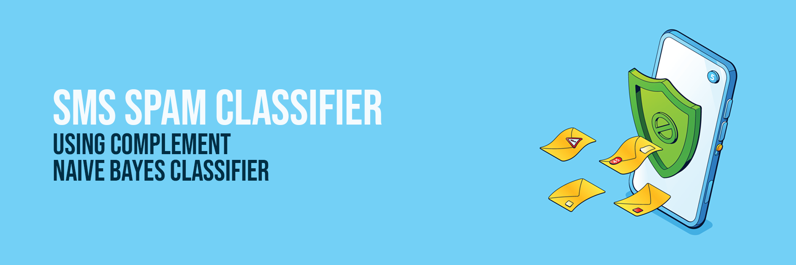
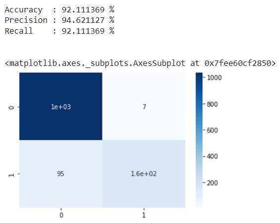

# Spam-Detector

## SMS Spam Detector using Naive Bayes

This project aims to develop a machine learning-based SMS spam detector system that accurately classifies incoming SMS messages as either spam or legitimate (non-spam) messages. The system utilizes the Naive Bayes algorithm for classification, as it has shown good performance in text classification tasks.

### Problem Statement

The problem is to create a reliable system that can efficiently identify and filter out spam messages, thus improving the user experience by reducing the number of unwanted or malicious SMS messages received. The main requirements and deliverables for the project include:

1. **Dataset**: Gather a labeled dataset of SMS messages, categorized as spam or non-spam, to train and evaluate the model.

2. **Preprocessing**: Preprocess the SMS data by removing irrelevant information, normalizing the text, and converting it into a suitable format for feature extraction.

3. **Feature Extraction**: Extract relevant features from the preprocessed SMS data to effectively capture the content and characteristics of spam and non-spam messages.

4. **Model Selection**: Utilize the Naive Bayes algorithm for classification and select the most suitable variant based on its performance on the SMS dataset.

5. **Model Training and Evaluation**: Split the dataset into training and testing sets, train the Naive Bayes model, and evaluate its performance using accuracy, precision, recall, and F1 score.

6. **Integration**: Develop a user-friendly interface that allows users to input SMS messages for classification and provides real-time feedback on the classification results.

7. **Deployment and Monitoring**: Deploy the SMS spam detector system on a suitable platform and implement monitoring mechanisms to continuously evaluate its performance.

8. **Performance Optimization**: Continuously monitor the system's performance and explore techniques like feature selection and hyperparameter tuning to enhance its accuracy and efficiency.

9. **Scalability and Efficiency**: Design the system to handle a large volume of incoming SMS messages efficiently, optimizing resource usage and minimizing latency.

 
  

In this project, I have attempted to analyze the SMS spam dataset and build a machine learning model to predict whether the message is spam or not.

## :floppy_disk: Project Files Description</h2>

This project contains an executable iPython Notebook, a presentation and source as follows:

<h4>Executable Files:</h4>
<ul>
  <li><b>SMS_Spam_Classifier.ipynb</b> - Google Colab notebook containing data summary, exploration, visualisations, text processing, modelling and performance evaluation.</li>
</ul>

<h4>Source Directory:</h4>
<ul>
  <li><b>SMSSpamCollection</b> - Includes SMS spam collection.</li>
</ul>

## :book: Problem Statement

Almost every person today owns a mobile phone with messaging and calling capabilities. Spam calls are infamous for the constant ringing of cell phones they often initiate to get promotional or fraudulent information to innocent customers. However, with the cheaper rates on bulk messaging services from wireless networks, a swarm of these spam calls has quickly shifted over to SMS messaging. There, in this scenario, classification becomes mandatory.
The objective of this project is to understand the SMS spam collection dataset and build a machine learning model to predict whether the mail is spam or not.

## :book: Approach

1.	Understanding the business task.
2.	Reading data from files given.
3.	Data pre-processing.
4.	Data visualization.
5.	Text processing.
6.	Modelling data.
7.	Conclusion.

## :book: Text Processing

<li>Stemming is used for text normalization since getting base words is more crucial than the meaning of words to determine whether the message is positive or not.</li> 
<li>Bag-of-Words was used for feature extraction from text since just the frequency of words needs to be considered instead of their importance.</li> 

## :book: Modelling

<li>Complement naive bayes classifier was used for training as each feature represents the frequency of the word in each message and to correct the severe assumptions made due to the imbalanced dataset.</li> 

## 📘: Conclusion

## :books: References
<ul>
  <li>
Analytics Vidhya, 'Stemming vs Lemmatization in NLP: Must-Know Differences'. [Online].

      
Available: https://www.analyticsvidhya.com/blog/2022/06/stemming-vs-lemmatization-in-nlp-must-know-differences/

  </li>
  <li>
Medium, 'Fundamentals of Bag Of Words and TF-IDF'. [Online].

      
Available: https://medium.com/analytics-vidhya/fundamentals-of-bag-of-words-and-tf-idf-9846d301ff22/

  </li>
  <li>
Scikit-learn, 'sklearn.naive_bayes.ComplementNB'. [Online].

      
Available: https://scikit-learn.org/stable/modules/generated/sklearn.naive_bayes.ComplementNB.html/

  </li>
</ul>

<a href="https://www.freepik.com/free-vector/anti-spam-protection-landing-page-concept-email-security-safety-web-mail-system-vector-banner-filter-service-from-phishing-junk-messages-with-isometric-smartphone-shield-letters_24499395.htm#query=spam&position=32&from_view=search&track=sph">Image by upklyak</a> on Freepik

### Acknowledgement:
This Project Assignment was part of Curriculum during **EPGP-DataScience AI-ML (Deep Learning Spec) from IIIT-B.**

***@All Rights Reserved*** [**Gurpreet Kaur Jethra**](https://github.com/GURPREETKAURJETHRA)
